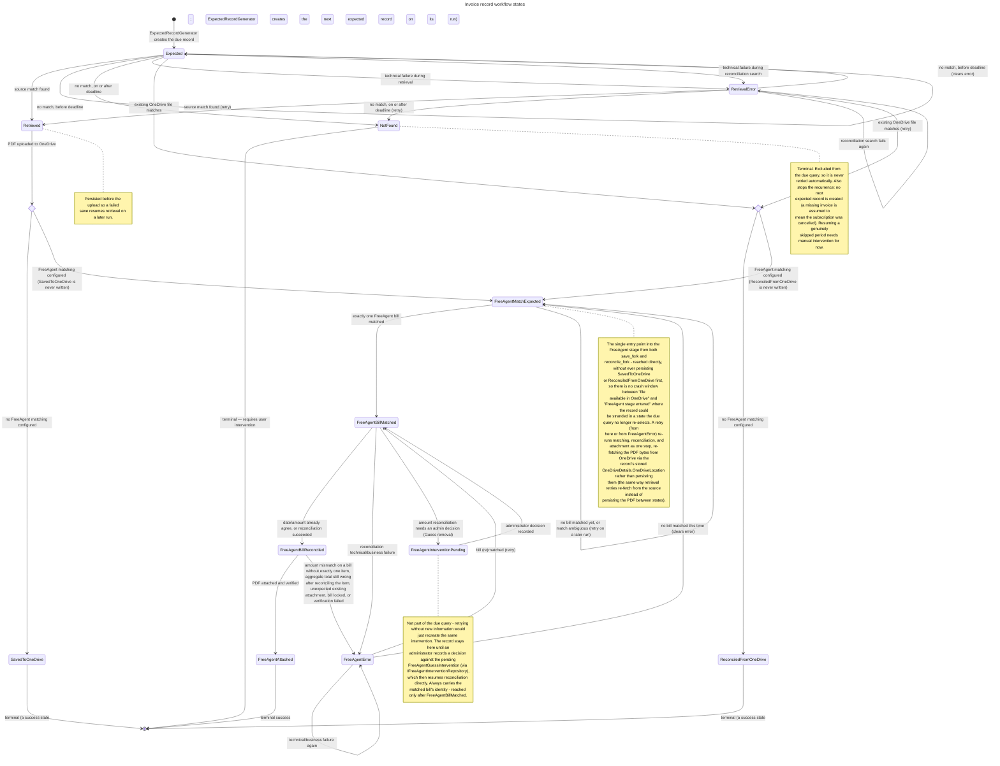

```mermaid
---
title: Invoice record workflow states
---
stateDiagram-v2
    %% States mirror the InvoiceWorkflowState union in
    %% src/InvoiceManager.Core/InvoiceWorkflowState.cs. Transitions are driven by
    %% DueInvoiceProcessor. Deadline = expectedDate + dateToleranceDays.
    %%
    %% ListDueAsync (CosmosInvoiceRecordRepository) re-selects records in Expected,
    %% RetrievalError, Retrieved, FreeAgentMatchExpected, or FreeAgentError - every
    %% state a record can sit in indefinitely awaiting a later automatic retry.
    %% FreeAgentInterventionPending is deliberately excluded: it only ever advances
    %% when an administrator records a decision (see its note below), never by
    %% polling. SavedToOneDrive and ReconciledFromOneDrive are only ever written
    %% (and are genuinely terminal) when the configuration has no FreeAgent
    %% matching - otherwise the record goes straight to FreeAgentMatchExpected and
    %% neither state is written at all. FreeAgentBillMatched and
    %% FreeAgentBillReconciled are left within the same ProcessAsync call that
    %% reached them - none of these four are ever a due record's starting state.

    [*] --> Expected : ExpectedRecordGenerator creates the due record

    %% --- Retrieval attempt (Expected / RetrievalError are both "due") ---
    %% Expected covers "not yet attempted" and "attempted, no match yet, in window".
    Expected --> Retrieved : source match found
    Expected --> Expected : no match, before deadline
    Expected --> NotFound : no match, on or after deadline
    Expected --> RetrievalError : technical failure during retrieval

    %% RetrievalError is always retried, with no retry limit.
    RetrievalError --> Retrieved : source match found (retry)
    RetrievalError --> Expected : no match, before deadline (clears error)
    RetrievalError --> NotFound : no match, on or after deadline (retry)
    RetrievalError --> RetrievalError : technical failure again

    %% --- Save path: a shared fork decides whether SavedToOneDrive is even written ---
    %% (skipped in favour of persisting FreeAgentMatchExpected directly) so a crash
    %% between "file available" and "FreeAgent stage entered" never strands the
    %% record in a state the due query has stopped re-selecting.
    state save_fork <<choice>>
    Retrieved --> save_fork : PDF uploaded to OneDrive
    save_fork --> SavedToOneDrive : no FreeAgent matching configured
    save_fork --> FreeAgentMatchExpected : FreeAgent matching configured (SavedToOneDrive is never written)
    SavedToOneDrive --> [*] : terminal (a success state; ExpectedRecordGenerator creates the next expected record on its next run)

    %% --- OneDrive reconciliation (checked before the source, for each due record) ---
    state reconcile_fork <<choice>>
    Expected --> reconcile_fork : existing OneDrive file matches
    RetrievalError --> reconcile_fork : existing OneDrive file matches (retry)
    reconcile_fork --> ReconciledFromOneDrive : no FreeAgent matching configured
    reconcile_fork --> FreeAgentMatchExpected : FreeAgent matching configured (ReconciledFromOneDrive is never written)
    ReconciledFromOneDrive --> [*] : terminal (a success state; ExpectedRecordGenerator creates the next expected record on its next run)
    Expected --> RetrievalError : technical failure during reconciliation search
    RetrievalError --> RetrievalError : reconciliation search fails again

    %% --- FreeAgent stage (all transitions emanate from FreeAgentMatchExpected) ---
    FreeAgentMatchExpected --> FreeAgentBillMatched : exactly one FreeAgent bill matched
    FreeAgentMatchExpected --> FreeAgentMatchExpected : no bill matched yet, or match ambiguous (retry on a later run)

    FreeAgentBillMatched --> FreeAgentBillReconciled : date/amount already agree, or reconciliation succeeded
    FreeAgentBillMatched --> FreeAgentError : reconciliation technical/business failure
    FreeAgentBillMatched --> FreeAgentInterventionPending : amount reconciliation needs an admin decision (Guess removal)

    FreeAgentBillReconciled --> FreeAgentAttached : PDF attached and verified
    FreeAgentBillReconciled --> FreeAgentError : amount mismatch on a bill without exactly one item, aggregate total still wrong after reconciling the item, unexpected existing attachment, bill locked, or verification failed

    %% FreeAgentError is always retried, with no retry limit - mirroring RetrievalError. It
    %% carries the bill matching had already found (if any) purely for diagnosis/display - a
    %% retry always re-enters at matching regardless, never skipping straight back to
    %% reconciliation against that same bill.
    FreeAgentError --> FreeAgentBillMatched : bill (re)matched (retry)
    FreeAgentError --> FreeAgentMatchExpected : no bill matched this time (clears error)
    FreeAgentError --> FreeAgentError : technical/business failure again

    %% An administrator's decision on a pending Guess-removal intervention resumes
    %% reconciliation directly - not via automatic polling (see note below).
    FreeAgentInterventionPending --> FreeAgentBillMatched : administrator decision recorded

    %% --- Terminal states ---
    FreeAgentAttached --> [*] : terminal success
    NotFound --> [*] : terminal — requires user intervention

    note right of NotFound
        Terminal. Excluded from the due query, so it is never
        retried automatically. Also stops the recurrence: no next
        expected record is created (a missing invoice is assumed to
        mean the subscription was cancelled). Resuming a genuinely
        skipped period needs manual intervention for now.
    end note

    note right of Retrieved
        Persisted before the upload so a failed
        save resumes retrieval on a later run.
    end note

    note right of FreeAgentMatchExpected
        The single entry point into the FreeAgent stage from both save_fork and
        reconcile_fork - reached directly, without ever persisting SavedToOneDrive
        or ReconciledFromOneDrive first, so there is no crash window between "file
        available in OneDrive" and "FreeAgent stage entered" where the record could
        be stranded in a state the due query no longer re-selects. A retry (from
        here or from FreeAgentError) re-runs matching, reconciliation, and
        attachment as one step, re-fetching the PDF bytes from OneDrive via the
        record's stored OneDriveDetails.OneDriveLocation rather than persisting
        them (the same way retrieval retries re-fetch from the source instead of
        persisting the PDF between states).
    end note

    note right of FreeAgentInterventionPending
        Not part of the due query - retrying without new information would
        just recreate the same intervention. The record stays here until an
        administrator records a decision against the pending
        FreeAgentGuessIntervention (via IFreeAgentInterventionRepository),
        which then resumes reconciliation directly. Always carries the
        matched bill's identity - reached only after FreeAgentBillMatched.
    end note
```
